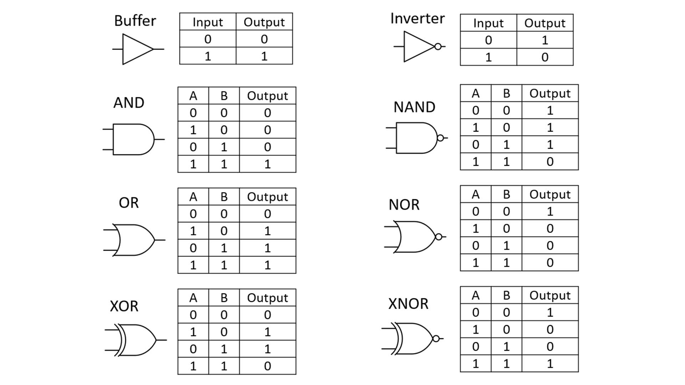
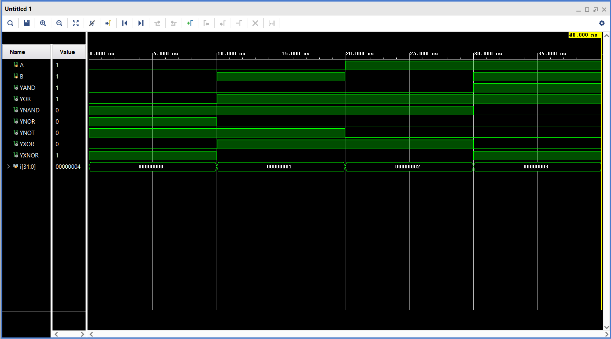
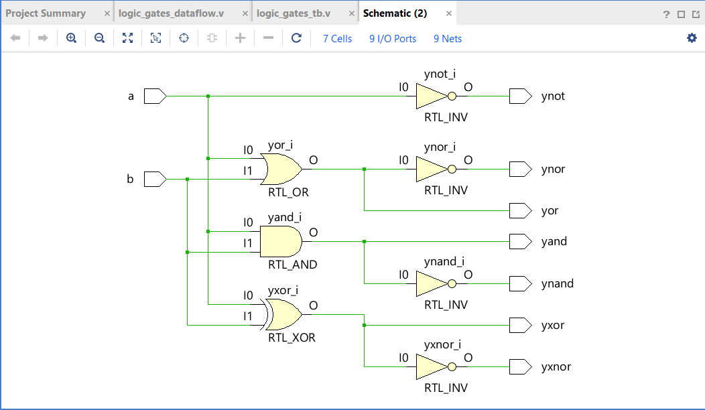

# RTL-Logic-Gates

Implementing Logic Gates using different levels of abstraction.

---

## Theory

Verilog supports 4 levels of abstraction:

**Data Flow Level:**
At this level, the module is designed by specifying the data flow — how data moves through the circuit. Signals are assigned using data manipulating equations, and the design is implemented using continuous assignment, i.e., the `assign` statement. Assignments in this level are concurrent in nature. Whenever RTL (Register Transfer Logic) is mentioned, the data flow level comes into action.

**Behavioural Level:**
This is the highest level of abstraction provided by HDL. It describes the behaviour of the system. Different elements like functions, tasks, and blocks can be used. The two most important constructs are `initial` and `always`.

**Gate Level / Structural Level:**
The module is implemented in terms of logic gates, which is the lowest level of abstraction. Basic logic gates are available as predefined primitives in Verilog's digital library — gates like `and`, `or`, `xor`, `nand`, `nor`, and `not` can be used directly without defining them.

**Switch Level:**
The module is implemented in terms of switches. At this level, the entire circuit can be represented as a CMOS circuit.

In this project, Logic Gates are implemented using **Data Flow**, **Behavioural**, and **Gate Level** implementations.

---

## Truth Table

| A | B | AND | OR | NAND | NOR | NOT (A) | XOR | XNOR |
|---|---|-----|----|------|-----|---------|-----|------|
| 0 | 0 |  0  |  0 |  1   |  1  |    1    |  0  |  1   |
| 0 | 1 |  0  |  1 |  1   |  0  |    1    |  1  |  0   |
| 1 | 0 |  0  |  1 |  1   |  0  |    0    |  1  |  0   |
| 1 | 1 |  1  |  1 |  0   |  0  |    0    |  0  |  1   |

---
## Symbols

---
## Waveforms

---
## Circuit

---
